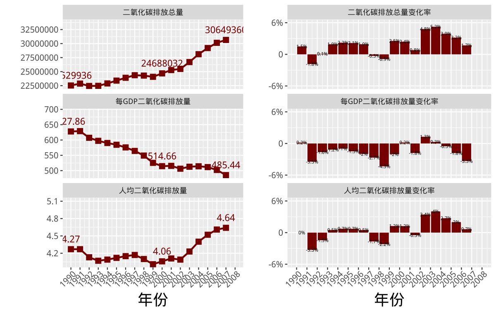
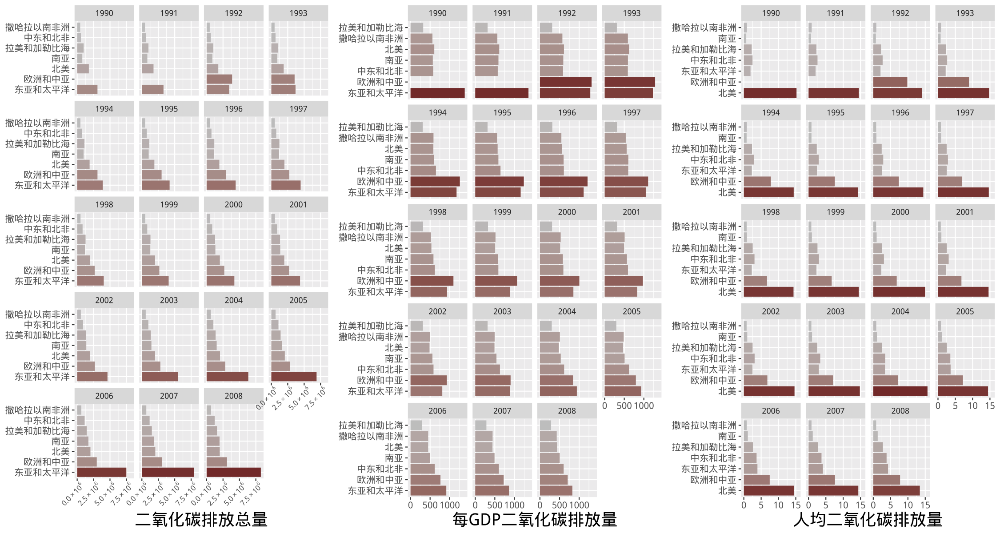
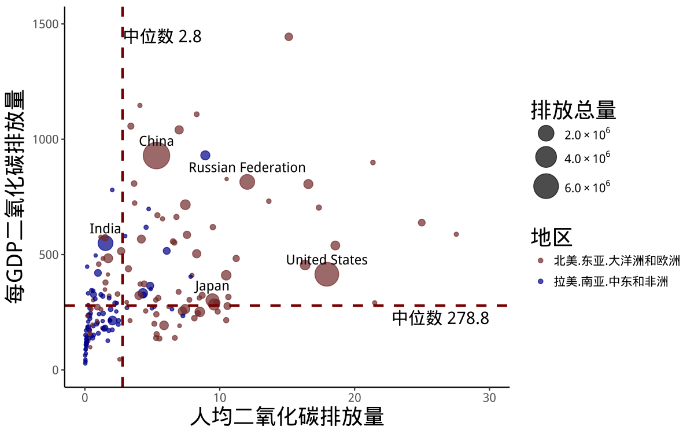
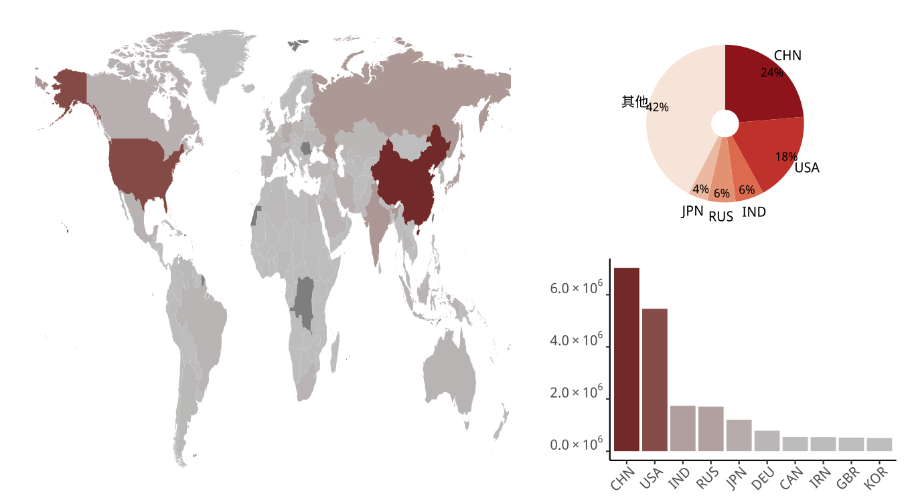

# README

github链接：https: //github.com/siyanli6315/co2emission

我们以 1990-2008 年的世界主要国家和地区的气候变化数据为研究对象，选取碳排放总量、单位 GDP 碳排放量人均碳排放量三个主要指标，基于 R 语言的绘图功能，通过数据可视化的手段，了解世界主要地区和国家碳排放情况和趋势以及不同年份的碳排放量的区域性差异。同时，将可视化方案制成 shinyapp 并上传 Rshiny 托管。

1. 原始数据和实验过程中生成的数据详见**原始数据**、**中间数据**文件夹。
2. 代码详见**代码**文件夹。
3. 文章内容见**全球二氧化碳排放情况分析.pdf**
4. shinyapp详见**Rshiny**文件夹。

shinyapp的使用方法：（需事先安装相关的包）

```R
library(shiny)
runApp("你的路径/co2bar")
```

## shinyapp预览

### 总体分析



左图展示了从 1990 年到 2007 年间，世界二氧化碳排放量，世界人均二氧化碳排放量，世界每 GDP 二氧化碳排放量等指标的基本情况。右图展示了从 1990 年到 2007 年，上述三个指标的年变化率。

shinyapp地址：https://siyanli6315.shinyapps.io/co2emission-line/(由于服务器限制，现暂停。)

### 分区域分析



左图展示了从 1990 年到 2008 年间，全球 7 个区域的二氧化碳排放总量变化情况。中图展 示了从 1990 年到 2008 年间，全球 7 个区域的每 GDP 二氧化碳排放量变化情况。右图展示了从 1990 年到 2008 年间，全球 7 个区域的人均二氧化碳排放量变化情况。

shinyapp地址：https://siyanli6315.shinyapps.io/co2bar/(由于服务器限制，现暂停。)

### 分国家分析



上图展示了 2008 年世界各国二氧化碳排放的基本情况。在上图中横轴表示人均二氧化碳排 放量，纵轴表示每 GDP 二氧化碳排放量，气泡表示国家，气泡大小表示二氧化碳排放总量，气泡 颜色表示区域(红色表示拉美、撒哈拉以南非洲和南亚。蓝色表示东亚太平洋地区、北美、欧洲和 中亚)。虚线表示人均二氧化碳排放量的中位数和每 GDP 二氧化碳排放的中位数。二氧化碳排放 量总量最高的五个国家在图中被标注出来。

shinyapp地址：https://siyanli6315.shinyapps.io/co2bubble/(由于服务器限制，现暂停。)



上图利用世界空间地理信息绘制了 2008 年各国二氧化碳排放总量的基本情况。左图颜色越 红表示二氧化碳排放总量越高，颜色越灰表示二氧化碳排放总量越低。右上饼图展现了二氧化碳排 放总量排名前五的国家及该国二氧化碳排放量占世界总排放量的比例。右下柱状图展现了二氧化 碳排放前十的国家及该国的排放总量。

地图数据来源于rWBclimate包。rWBclimate包的github连接如下：https://github.com/ropensci/rWBclimate


shinyapp地址：https://siyanli6315.shinyapps.io/co2map/(由于服务器限制，现暂停。)
