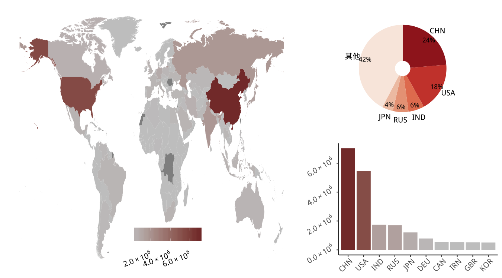
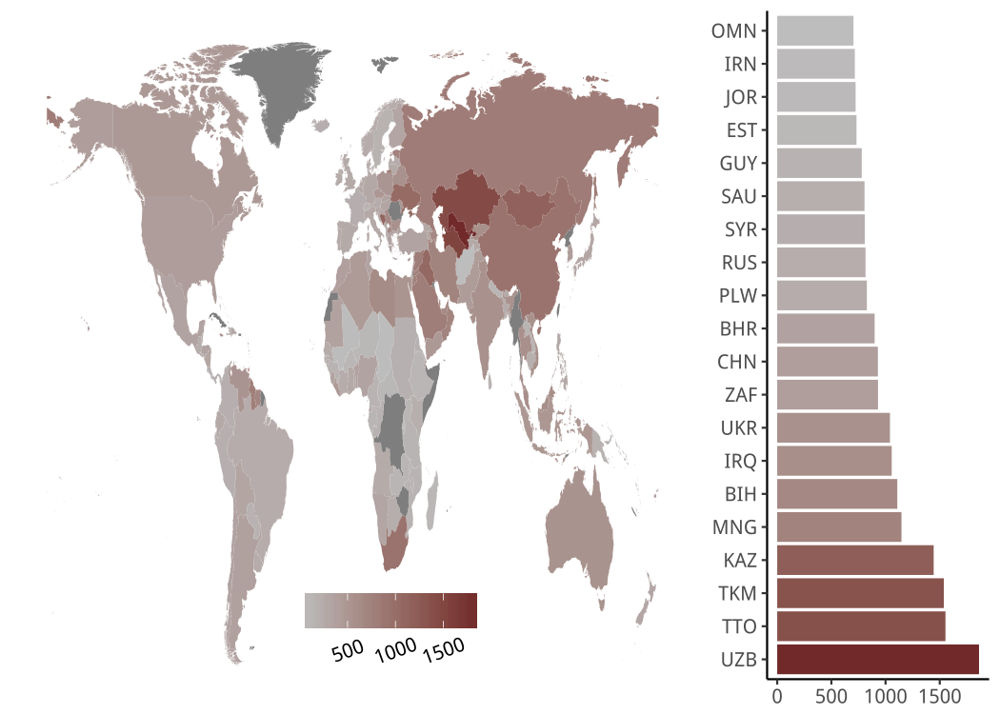
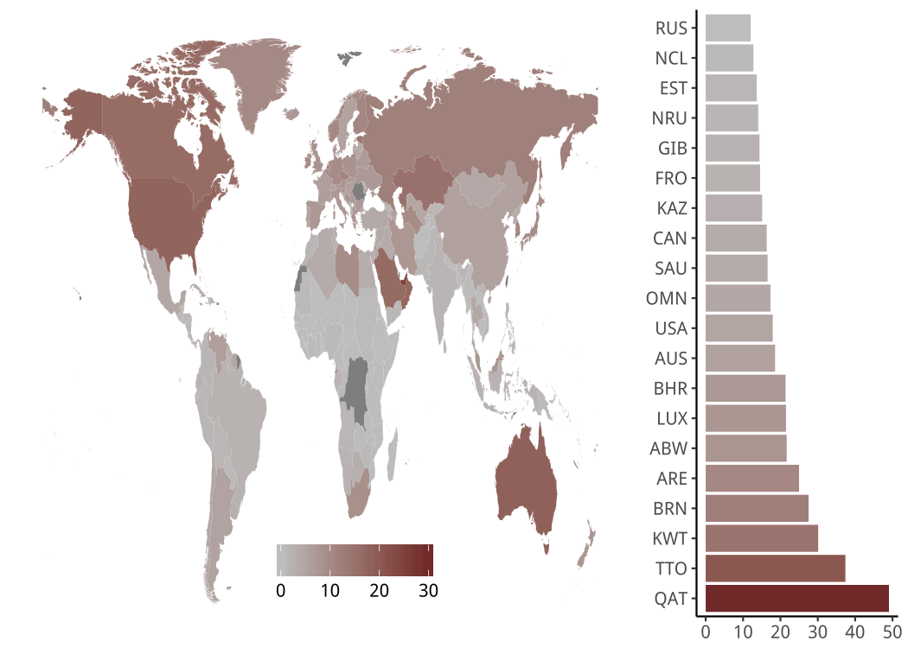
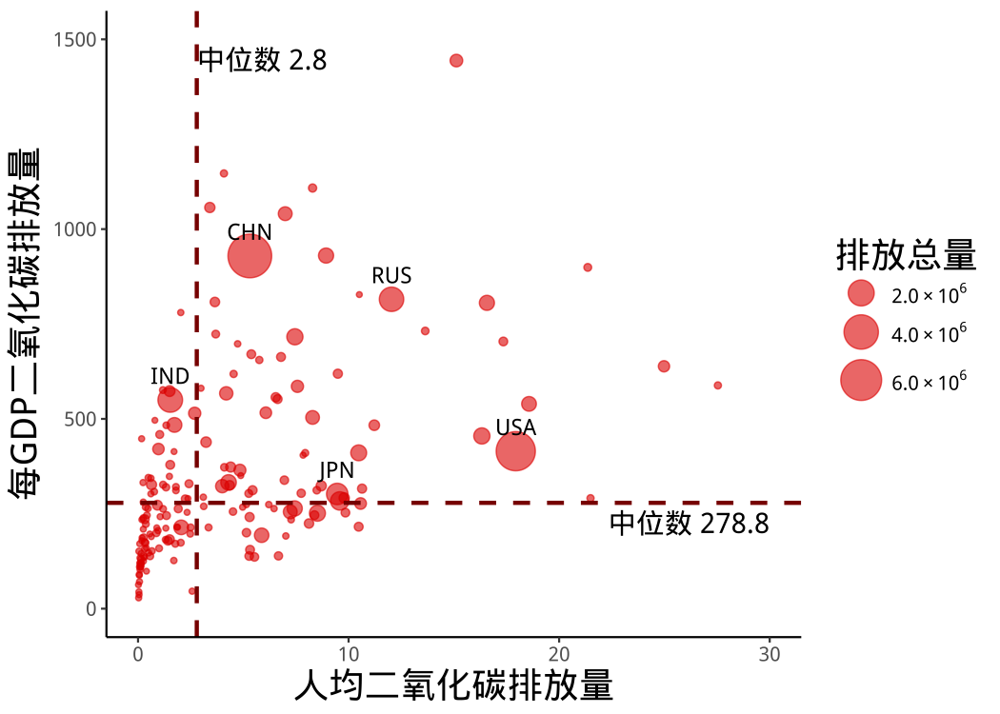
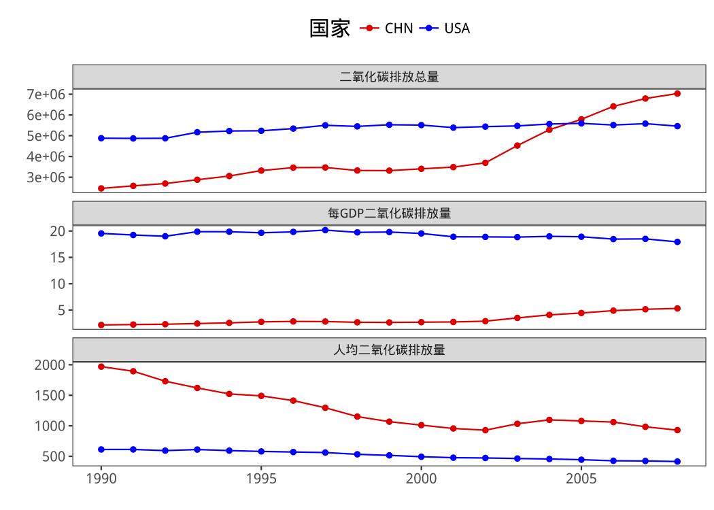

# README

我使用Rshiny和ggplot2构建了1990年到2008年世界各国二氧化碳排放量的可视化方案。

## 数据来源

二氧化碳排放量数据来源于[世界银行](http://data.worldbank.org.cn)。数据包含了1990年到2008年全球200多个国家和地区的二氧化碳排放量、人均二氧化碳排放量和每GDP二氧化碳排放量等三个指标。

地图数据来源于rWBclimate包。rWBclimate包的github连接如下：https://github.com/ropensci/rWBclimate

## Rshinyapp

### 二氧化碳排放总量



左图颜色越红表示二氧化碳排放总量越高，颜色越灰表示二氧化碳排放总量越低。右上饼图展现了二氧化碳排放总量排名前五的国家及该国二氧化碳排放量占世界总排放量的比例。右下柱状图展现了二氧化碳排放前十的国家及该国的排放总量。

目前，二氧化碳排放总量地图可以实现在菜单栏中拖动时间轴比较1990年到2008年期间每年排放总量情况。地图链接如下：https://siyanli6315.shinyapps.io/co2emission-tot/

也可以通过下载**二氧化碳排放总量**文件夹在本机上运行，本机上运行的程序如下：（应当事先装好所需的包）

```R
library(shiny)
runApp("你的路径/二氧化碳排放总量")
```

### 每GDP二氧化碳排放量



左图颜色越红表示每GDP二氧化碳排放量越高，颜色越灰表示每GDP二氧化碳排放量越低。右图展现了每GDP二氧化碳排放量前二十的国家及该国该指标的大小。

目前，地图可以实现在菜单栏中拖动时间轴比较1990年到2008年期间每年的情况。地图链接如下：https://siyanli6315.shinyapps.io/co2emission-pg/

也可以通过下载**每GDP二氧化碳排放量**文件夹在本机上运行，本机上运行的程序如下：（应当事先装好所需的包）

```R
library(shiny)
runApp("你的路径/每GDP二氧化碳排放量")
```

### 人均二氧化碳排放量



左图颜色越红表示人均二氧化碳排放量越高，颜色越灰表示人均二氧化碳排放量越低。右图展现了人均二氧化碳排放量前二十的国家及该国该指标的大小。

目前，地图可以实现在菜单栏中拖动时间轴比较1990年到2008年期间每年的情况。地图链接如下：https://siyanli6315.shinyapps.io/co2emission-pc/

也可以通过下载**人均二氧化碳排放量**文件夹在本机上运行，本机上运行的程序如下：（应当事先装好所需的包）

```R
library(shiny)
runApp("你的路径/人均二氧化碳排放量")
```

### 气泡图

 

气泡图横轴表示人均二氧化碳排放量，纵轴表示每GDP二氧化碳排放量，气泡大小表示二氧化碳排放总量。所有的气泡被人均二氧化碳排放量的中位数和每GDP二氧化碳排放的中位数分成了四个象限。二氧化碳排放量总量最高的五个国家将在图中被标注。

目前，气泡图可以实现拖动工具栏的时间轴比较从1990年到2008年每年的情况。

气泡图的链接如下：https://siyanli6315.shinyapps.io/co2emission-bubble/

上述app也可以通过下载**气泡图**文件夹在本机上运行，本机上运行的程序如下：（应当事先装好所需的包）

```R
library(shiny)
runApp("你的路径/气泡图")
```

### 折线图



目前，折线图可以实现在菜单栏中选择两个国家进行比较。比较的项目包含1990年到2008年期间每年的二氧化碳排放量、人均二氧化碳排放量和每GDP二氧化碳排放量等三个指标，折线图的链接如下：https://siyanli6315.shinyapps.io/co2emission-line/

也可以通过下载**折线图**文件夹在本机上运行，本机上运行的程序如下：（应当事先装好所需的包）

```R
library(shiny)
runApp("你的路径/折线图")
```
